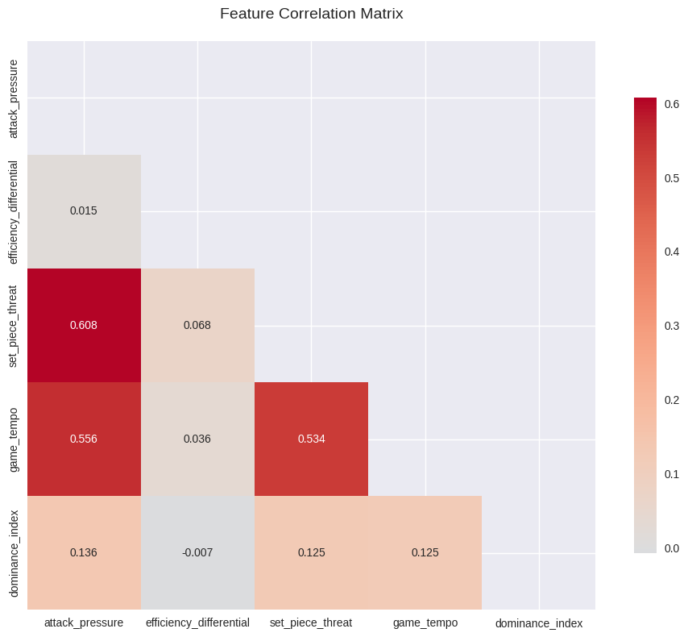
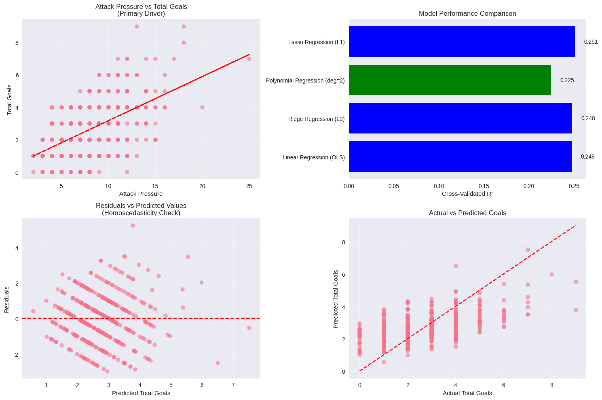

# ⚽ Football Goal Analysis: Leveraging Domain Expertise for Explanatory Modeling
[](https://colab.research.google.com/drive/1imjXMM3oyQBxos7czGpKQ99TOC6sTxuV)

**Combining a background in sports journalism with data science, this project moves beyond prediction to *explanation*, identifying the in-game factors that drive 28.3% of goal variance using composite feature engineering.**

| **Aspect** | **Insight** |
|------------|-------------|
| **Primary Objective** | **Explanatory Modeling** to understand *why*, not just predict |
| **Key Driver Found** | `attack_pressure` (a composite shot efficiency metric) |
| **Variance Explained** | **28.3%** of total goal variance (Adjusted R²) |
| **Domain Insight** | Quantified home advantage at **+0.39 goals per match** |
| **Validation** | Model stability confirmed via 5-fold cross-validation |

### 📊 Quick Insights
- **Home Advantage**: +0.39 goals per match for home teams
- **Primary Driver**: Attack pressure (shot efficiency metric)
- **Model Stability**: Cross-validation R² = 0.248 ± 0.117
- **Features**: 5 composite metrics from 65+ raw variables

## 🔍 Methodology

### **1. Explanatory vs Predictive Modeling**
- **Explanatory Focus**: Understanding relationships in available data
- **Full Dataset**: No train-test split (maximum explanatory power)
- **Validation**: 5-fold cross-validation for stability assessment

### **2. Feature Engineering**
Created 5 composite features from raw match statistics:
1. **`attack_pressure`** - Weighted shot efficiency metric
2. **`efficiency_differential`** - Home vs away shot efficiency
3. **`set_piece_threat`** - Corner-based threat indicator
4. **`game_tempo`** - Match intensity (actions per minute)
5. **`dominance_index`** - Log-ratio of home/away actions

### **3. Model Comparison**
Tested 4 linear regression variations:
- **Linear Regression (OLS)** - Best performer (Adj. R²: 0.283)
- **Lasso Regression (L1)** - Sparse solution (Adj. R²: 0.266)
- **Ridge Regression (L2)** - Regularized (Adj. R²: 0.283)
- **Polynomial Regression (deg=2)** - Non-linear terms (Adj. R²: 0.277)


## 🛠️ Skills Demonstrated
This project showcases practical application of:

| Category | Technologies & Techniques |
|----------|--------------------------|
| **Statistical Modeling** | Linear Regression (OLS, Ridge, Lasso), Polynomial Regression, Cross-validation |
| **Feature Engineering** | Composite feature creation, multicollinearity analysis (VIF), correlation analysis |
| **Data Analysis** | pandas, NumPy, statistical inference (p-values), residual diagnostics |
| **Data Visualization** | Matplotlib, Seaborn, correlation heatmaps, multi-panel plots |
| **Experimental Design** | Explanatory vs. predictive modeling, full-dataset analysis for maximum insight |
| **Validation** | 5-fold cross-validation for model stability, homoscedasticity checks |


## 📈 Results


### **Model Performance**
| Model | Adjusted R² | CV R² (Stability) | Features |
|-------|-------------|-------------------|----------|
| Linear Regression (OLS) | **0.283** | 0.248 ± 0.117 | 5 |
| Ridge Regression | 0.283 | 0.248 ± 0.117 | 5 |
| Polynomial Regression | 0.277 | 0.225 ± 0.114 | 20 |
| Lasso Regression | 0.266 | 0.251 ± 0.097 | 5 |

### **Key Findings**
1. **Attack pressure** is the most significant predictor of total goals
2. **Home teams score 33% more** than away teams (1.60 vs 1.20 avg goals)
3. **Efficiency differential** (shot accuracy gap) strongly influences outcomes
4. **Low multicollinearity** - All VIF scores < 5

### 📊 Visual Results

**Feature Analysis:**

*Low correlations between composite features (all < 0.7) - ideal for linear regression*


**Model Performance & Diagnostics:**

*Four-panel visualization showing:*
1. **Attack Pressure vs Goals**: Primary relationship identified
2. **Model Performance Comparison**: Linear Regression (OLS) performs best
3. **Residuals Analysis**: Homoscedastic pattern confirms model assumptions
4. **Actual vs Predicted**: Good alignment along the diagonal

## 🚀 How to Run

### **Prerequisites**
- Python 3.8+
- Kaggle account (for dataset access)

### **Installation**
```bash
# Clone repository
git clone https://github.com/SWMLearner/football-goal-analysis.git
cd football-goal-analysis

# Install dependencies
pip install -r requirements.txt
```

### Run the Analysis


Execute the main script (dataset is included in the code):

```bash
python mlregression.py
```

Note: This is an explanatory analysis (not predictive). The script will output statistical findings and generate visualizations in the assets/ folder.

```bash
football-goal-analysis/
├── mlregression.py              # Main analysis script 
├── README.md                    # Project documentation
├── requirements.txt             # Python dependencies
└── assets/                      # Generated visualizations
    ├── correlation_matrix.png
    └── model_analysis_dashboard.png
```
Note: The script automatically downloads the dataset during execution, so no separate data folder is required in the repository.
